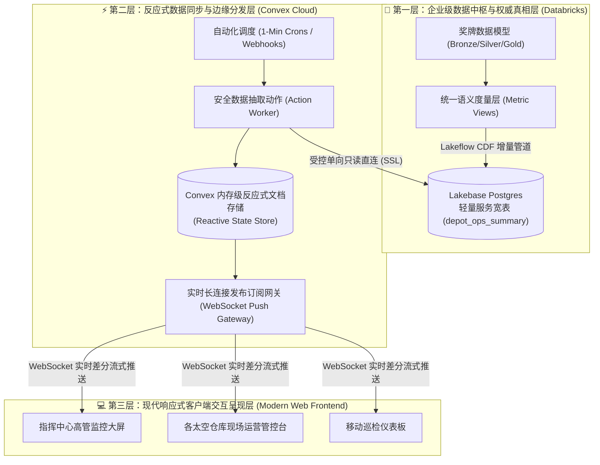

# 🛰️ Helios Depot Operations Console (Helios 实时运营管控中心)

> **架构体系**：Databricks Lakebase + Convex Cloud + 现代 Web 前端反应式混合架构  
> **设计依据**：根据 [`helios_ops_convex_prd.md`](../The+Data+Engineering+Simulator/The%20Data%20Engineering%20Simulator/06_lakebase_app/helios_ops_convex_prd.md) 规格文档实现。

---

## 1. 架构总览 (Three-Layer Architecture)

本项目解耦了传统的“数仓直接面对高并发 Web”以及“前端频繁 HTTP 轮询”的痛点，构建了高并发、零指标漂移、全员亚秒级协同的现代指挥大屏：



---

## 2. 目录结构

```
helios-ops-console/
├── databricks/                         # 🏢 第一层：Databricks 数据资产与安全脚本
│   ├── ddl_depot_ops_summary.sql       # 固化 Section 5 语义层的服务表并开启 CDF
│   ├── lakebase_least_privilege.sql    # 最小权限 dedicated service role (只读 CONNECT + SELECT)
│   ├── databricks_webhook_trigger.py   # Databricks 批次完成后触发 Convex 瞬时推送的脚本
│   └── test_lakebase_connection.py     # Lakebase Postgres 连通性与权限诊断工具
├── convex/                             # ⚡ 第二层：Convex 反应式云后端
│   ├── convex.json                     # Convex 项目配置
│   ├── schema.ts                       # depot_ops / sync_logs / ops_commands 架构定义
│   ├── depots.ts                       # 反应式订阅查询 (getSummary, getDepot, getSyncLogs)
│   ├── operations.ts                   # 操作下发与变动突变 (dispatchEmergencyStock, acknowledgeIncident)
│   ├── lakebaseSync.ts                 # 安全 Action 提取器 (直连 Lakebase / diff 计算 / 容错快照)
│   └── crons.ts                        # 1分钟定时拉取调度器
├── src/                                # 💻 第三层：现代响应式沉浸大屏前端
│   ├── components/
│   │   ├── Header.tsx                  # 顶部航天仪表条、Sol 时间、状态胶囊、音效与操作面板开关
│   │   ├── MetricCard.tsx              # 关键绩效指标 KPI 卡片，带差分微动画跳变
│   │   ├── SolarSystemMap.tsx          # 太阳系全天候雷达轨道图，交互式聚焦 6 大核心仓
│   │   ├── DepotGrid.tsx               # 6 大核心仓实时监测卡片网关，通讯状态、毛利告警
│   │   ├── DepotDetailModal.tsx        # 仓库深度遥测、财务与履约指标钻取弹窗
│   │   ├── OperationsActionPanel.tsx   # 跨仓紧急调拨下发 (写路径) 与实时告警确认队列
│   │   ├── ComparisonTable.tsx         # 全仓库可排序、可过滤对比矩阵 (对齐 Lab 6.5)
│   │   ├── OperationsLog.tsx           # WebSocket 实时流式差分与 Lakebase 同步心跳日志
│   │   └── DevControlHUD.tsx           # 开发者与演练抽屉 (批次3毛利暴跌模拟、瞬时拉取、还原基线)
│   ├── context/
│   │   └── HeliosDataContext.tsx      # 统一反应式数据总线 (自动桥接 Convex 与离线高保真仿真器)
│   ├── data/
│   │   └── initialDepots.ts            # 规范初始基线数据 (Helios Prime, Luna Hub, Ares, etc.)
│   ├── types/
│   │   └── helios.ts                   # 强类型 TypeScript 数据模型
│   ├── utils/
│   │   └── formatters.ts               # CREDITS 货币、百分比、Sol 历法格式化器
│   ├── App.tsx                         # 主看板整合组件
│   ├── index.css                       # 深空曜石、霓虹天青、恒星金 Modern CSS 视觉体系
│   └── main.tsx                        # 反应式 Provider 挂载点
├── index.html                          # 预载 Orbitron / Inter / JetBrains Mono 字体
├── package.json
└── vite.config.ts
```

---

## 3. 核心功能与演练场景 (Features & Scenarios)

1. **统一指标无二次漂移**：
   - 严格继承 Databricks `sales_mv`, `orders_mv`, `inventory_mv` 语义层定义的指标（收入、毛利率、准时履约率、缺货事件、取消率）。
2. **Batch 3 故障演练 (Ares Margin Anomaly)**：
   - 在控制台中点击 **DEV CONTROLS** 或 Ares 仓库卡片，可一键注入或解除 **“Batch 3 推进器供应商 (SUP-11) 成本剧增导致 Ares 毛利率从 38% 暴跌至 23%”** 的故障场景，观察全网大屏瞬时红色告警跳变。
3. **紧急跨仓调拨 (Write Path / 乐观更新)**：
   - 在“跨仓紧急调拨”表单中选择来源仓（如 Luna Hub）与目标仓（如 Ares Depot），输入调拨调剂数量；
   - 提交瞬间前端触发**乐观更新**，缺货数立即压降，屏幕触发粒子反馈，同时将指令记录推入 Lakebase 回流队列。
4. **太阳系轨道交互式雷达 (Orbital Radar)**：
   - 动态呈现太阳、地球-月球（Helios Prime, Luna Hub）、火星（Ares Depot）、小行星带（Ceres Exchange）、木星/欧罗巴（Europa Outpost）以及土星/泰坦（Titan Yard）的实时轨道与通讯信标。
5. **离线与无配置即开即用**：
   - 前端内置智能状态机。即使在尚未配置 Convex 密钥的本地开发或教学演示模式下，也会自动启动**高保真反应式推流引擎**，完美展示每分钟增量拉取、差分推送微动画与指令下发。

---

## 4. 快速启动指南

### 4.1 本地启动前端与演练大屏
```bash
# 1. 进入项目根目录
cd helios-ops-console

# 2. 启动 Vite 开发服务器
npm run dev
```
打开浏览器访问控制台输出的地址（如 `http://localhost:5173`），即可体验沉浸式太阳系运营管控中心！

### 4.2 接入 Convex Cloud 生产后端 (可选)
```bash
# 1. 登录并初始化 Convex 项目
npx convex dev

# 2. 将生成的 Convex 部署 URL 填入 .env
echo "VITE_CONVEX_URL=https://your-convex-deployment.convex.cloud" > .env

# 3. 在 Convex Dashboard > Settings > Environment Variables 中配置只读账号：
# LAKEBASE_PGHOST=...
# LAKEBASE_PGPASSWORD=...
```

### 4.3 在 Databricks 中部署 Lakebase 宽表
1. 在 Databricks 工作区中打开 SQL Editor，执行 [`databricks/ddl_depot_ops_summary.sql`](databricks/ddl_depot_ops_summary.sql) 创建开启 CDF 的宽表。
2. 执行 [`databricks/lakebase_least_privilege.sql`](databricks/lakebase_least_privilege.sql) 创建受限的 `convex_reader` 只读账号。
3. 可选：在 Databricks Workflow 批次任务末尾添加 [`databricks/databricks_webhook_trigger.py`](databricks/databricks_webhook_trigger.py) 实现流水线竣工瞬时推流。
